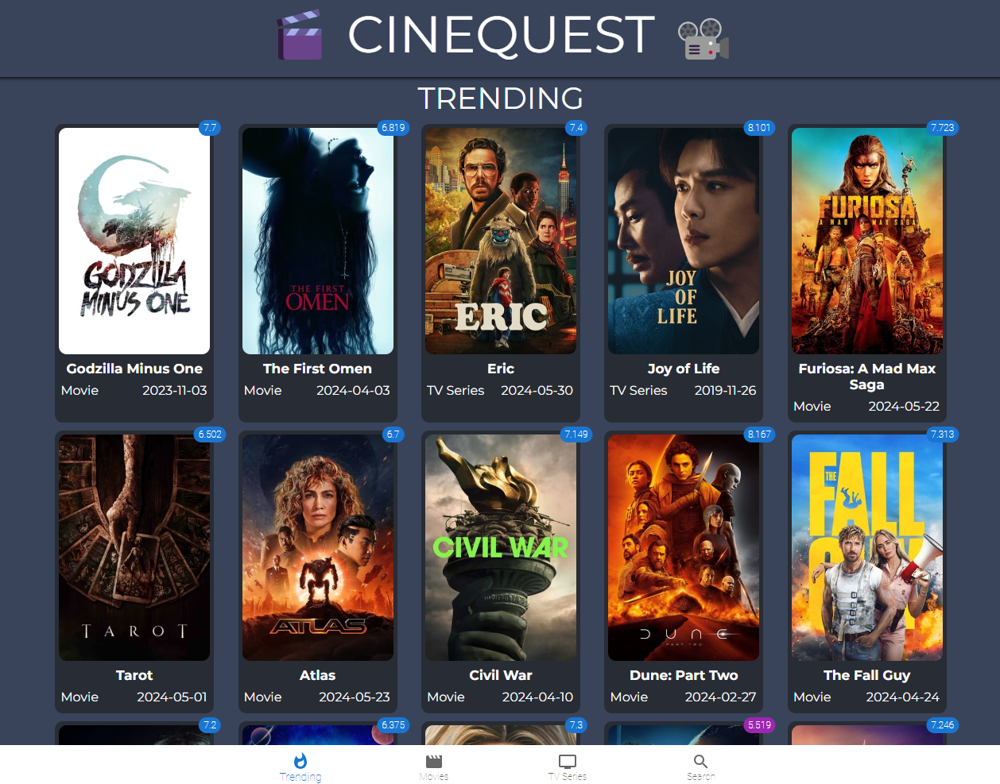

# CineQuest

## A Movie and TV Series Search Application

## Overview
This application allows users to search for movies and TV series, view their descriptions, and watch trailers. It utilizes Material-UI for styled components and The Movie Database (TMDb) API for fetching information related to movies and TV series.

## UI Layout


## Live Demo
[Cinequest](https://cinequest-by-atharv.netlify.app/)

## Features
- **Search Functionality**: Allows users to search for movies and TV series by name.
- **Movie and TV Series Details**: Provides detailed information such as description, release date, and rating.
- **Watch Trailers**: Users can view trailers for movies and TV series.
- **Styled Components**: The application uses Material-UI for modern and responsive design.

## Installation

1. Clone the repository:
    ```bash
    git clone https://github.com/atharvdange618/CineQuest.git
    ```
2. Navigate to the project directory:
    ```bash
    cd CineQuest
    ```
3. Install the dependencies:
    ```bash
    npm install
    ```
4. Create a `.env` file in the root directory and add your TMDb API key:
    ```
    TMDB_API_KEY=your_api_key_here
    ```
5. Start the development server:
    ```bash
    npm start
    ```

## Usage
- Open the application in your browser.
- Use the search bar to find movies or TV series.
- Click on a movie or TV series to view its details and watch the trailer.

## Technologies Used
- **React**: A JavaScript library for building user interfaces.
- **Material-UI**: React components for faster and easier web development.
- **The Movie Database (TMDb) API**: Provides movie, TV series, and actor information.

## Contribution

Your contributions and suggestions are welcome! Here's how you can contribute to this repository:

1. Fork the repository
2. Create a new branch
3. Make your changes
4. Submit a pull request

## License
This project is licensed under the MIT License. See the [LICENSE](LICENSE) file for details.

## Acknowledgements
- [Material-UI](https://material-ui.com/)
- [The Movie Database (TMDb) API](https://www.themoviedb.org/documentation/api)

## Contact

If you have any questions or suggestions, please feel free to contact me:

- Email: [atharvdange.dev@gmail.com](mailto:atharvdange.dev@gmail.com)
- LinkedIn: [Atharv Dange](www.linkedin.com/in/atharvdange)
- Twitter: [@atharvdangedev](https://twitter.com/atharvdangedev)